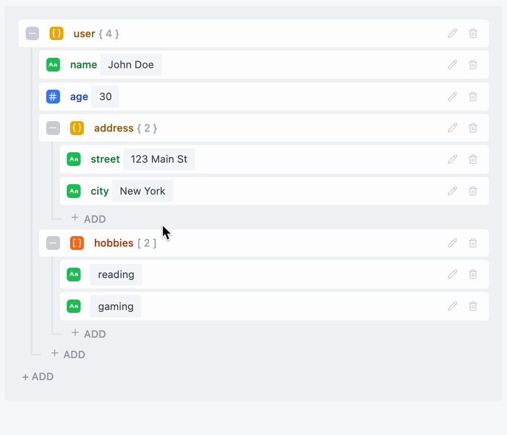

# jxSon

[](https://badge.fury.io/js/@rucire%2Fjxson-vue)
[](https://opensource.org/licenses/MIT)

A powerful, feature-rich JSON editor component library by **Rucire**. Currently available for Vue 3 applications with real-time validation and a beautiful UI. React version coming soon!

[Live Demo](http://localhost:5173/) • [Documentation](#documentation) • [Examples](#examples) • [Contributing](#contributing)

## 🎬 Demo



*Interactive demo showing real-time editing, validation, and responsive design*

## ✨ Features

- 🎨 **Beautiful UI** - Clean, modern interface with Tailwind CSS styling
- 📝 **Real-time Editing** - Live updates as you type with instant validation
- 🏗️ **Flexible Structure** - Support for all JSON data types (objects, arrays, strings, numbers, booleans)
- ✅ **Validation** - Built-in JSON validation with helpful error messages  
- 🎯 **Type Safety** - Full TypeScript support with comprehensive type definitions
- 📱 **Responsive** - Works perfectly on desktop, tablet, and mobile devices
- 🎛️ **Customizable** - Extensive props for customization and theming
- 🚀 **Performance** - Optimized for large JSON files with efficient rendering

## 🚀 Quick Start

### Installation

```bash
# npm
npm install @rucire/jxson-vue

# yarn
yarn add @rucire/jxson-vue

# pnpm
pnpm add @rucire/jxson-vue
```

### Basic Usage

```vue
<template>
  <div>
    <JxEditor v-model="jsonData" />
    <pre>{{ JSON.stringify(jsonData, null, 2) }}</pre>
  </div>
</template>

<script setup lang="ts">
import { ref } from 'vue'
import { JxEditor } from '@rucire/jxson-vue'

const jsonData = ref({
  name: "John Doe",
  age: 30,
  isActive: true,
  hobbies: ["reading", "coding"],
  address: {
    street: "123 Main St",
    city: "New York"
  }
})
</script>
```

## 📖 Documentation

### Props

| Prop | Type | Default | Description |
|------|------|---------|-------------|
| `modelValue` | `object` | `{}` | The JSON object to edit |
| `showTypeLabel` | `boolean` | `true` | Show type labels for fields |
| `showFieldCount` | `boolean` | `true` | Show field count for objects |
| `showArrayCount` | `boolean` | `true` | Show item count for arrays |
| `placeholder` | `object` | `{}` | Placeholder text for name/value inputs |
| `disabled` | `boolean` | `false` | Disable all editing functionality |
| `readOnly` | `boolean` | `false` | Enable read-only mode |
| `allowDelete` | `boolean` | `true` | Allow deleting fields |
| `allowEdit` | `boolean` | `true` | Allow editing field names and values |
| `allowAdd` | `boolean` | `true` | Allow adding new fields |
| `allowExpand` | `boolean` | `true` | Allow expanding/collapsing objects and arrays |
| `customIcons` | `object` | `{}` | Custom icon components |

### Events

| Event | Payload | Description |
|-------|---------|-------------|
| `update:modelValue` | `any` | Emitted when the JSON data changes |

### Advanced Usage

```vue
<template>
  <JxEditor
    v-model="jsonData"
    :read-only="isReadOnly"
    :disabled="isDisabled"
    :custom-icons="customIcons"
    @update:modelValue="handleUpdate"
  />
</template>

<script setup lang="ts">
import { ref } from 'vue'
import { JxEditor } from '@rucire/jxson-vue'
import { Save, Edit, Trash } from 'lucide-vue-next'

const jsonData = ref({})
const isReadOnly = ref(false)
const isDisabled = ref(false)

const customIcons = {
  save: Save,
  edit: Edit,
  delete: Trash
}

function handleUpdate(newValue: any) {
  console.log('JSON updated:', newValue)
}
</script>
```

## 📦 Project Structure

This is a monorepo containing:

- **`packages/vue/`** - Vue 3 component library (current)
- **`packages/react/`** - React component library (coming soon)
- **`examples/`** - Interactive examples and demos
- **`docs/`** - Documentation and guides

## 🔮 Roadmap

- ✅ **Vue 3 Support** - Complete with all features
- 🚧 **React Support** - Coming soon!
- 🔄 **Angular Support** - Planned for future release
- 🎨 **Theme System** - Advanced theming capabilities
- 🔌 **Plugin System** - Extensible architecture

## 🎯 Examples

The project includes several interactive examples:

- **Basic Usage** - Simple JSON editing with live preview
- **Nested Structures** - Complex nested objects and arrays
- **Read-Only Mode** - Viewing JSON data without editing capabilities

To run the examples locally:

```bash
git clone https://github.com/Rucire/jxSon.git
cd jxson
pnpm install
pnpm dev
```

Then open http://localhost:5173 in your browser.

## 🛠️ Development

### Prerequisites

- Node.js 18+ 
- pnpm 8+

### Setup

```bash
# Clone the repository
git clone https://github.com/Rucire/jxSon.git
cd jxson

# Install dependencies
pnpm install

# Start development server
pnpm dev

# Build the library
pnpm build
```

### Workspace Commands

```bash
# Run examples
pnpm dev

# Build Vue package
pnpm build

# Format code
pnpm --filter @rucire/jxson-vue format

# Type check
pnpm --filter @rucire/jxson-vue build
```

## 🧪 Testing

The component includes comprehensive validation and error handling:

- **Field validation** - Prevents invalid field names
- **Duplicate detection** - Visual warnings for duplicate field names
- **Type safety** - TypeScript ensures type correctness
- **Accessibility** - ARIA labels and keyboard navigation

## 🎨 Styling

The component uses Tailwind CSS classes and can be customized through:

- CSS custom properties
- Tailwind configuration
- Custom icon components
- Theme overrides

## 🤝 Contributing

We welcome contributions! Please see our [Contributing Guide](CONTRIBUTING.md) for details on:

- Setting up the development environment
- Code style and conventions
- Submitting pull requests
- Reporting bugs

## 📝 License

This project is licensed under the MIT License - see the [LICENSE](LICENSE) file for details.

## 🏢 Company

**Rucire**

Building powerful, beautiful UI components for modern web development.

- GitHub: [@rucire](https://github.com/rucire)

## 🙏 Acknowledgments

- [Vue.js](https://vuejs.org/) - The progressive JavaScript framework
- [Lucide](https://lucide.dev/) - For beautiful icons
- [Tailwind CSS](https://tailwindcss.com/) - For utility-first styling